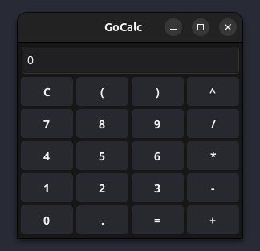

# GoCalc
GoCal é um desafio de projeto da DIO onde o objetivo geral era desenvolver um algorítimo de calculadora executando testes unitários.



## Solução proposta
Como solução para o desafio resolvi criar um app de interface gráfica utilizando a biblioteca [fyne](https://fyne.io/) e implementar o algorítimo [Shunting Yard](https://en.wikipedia.org/wiki/Shunting_yard_algorithm). Todos os testes para os elementos do domínio da aplicação podem ser encontrados junto de suas respectivas implementações a nível de pacote.

## Shunting Yard
O algorítimo de Shunting Yard é um algorítimo criado por Edsger Dijkstra e utilizado para resolver expressões matemáticas fazendo a conversão de uma notação infixa **(ex: 3 + 4 * 2)** para a notação pós fixa **(ex: 3 4 2 * +)**.

#### Como funciona

Antes de tudo é necessário separar a expressão em tokens, no app cada token é representado pela seguinte estrutura:
```go
type Token struct {
	Value         string
	Type          string
	Precedence    int
	Associativity string
}
```
Basicamente, o algorítimo utiliza-se de uma **pilha de operadores** e uma **fila de saída** na qual sera armazenado o resultado da conversão. Aqui esta um exemplo em pseudo código:

```
ENQUANTO houver tokens para serem lidos:
    lê o token

    SE o token é um número:
        adiciona ele na fila de saída

    SE o token é um operador:
        ENQUANTO hover operadores na pilha e o operador do topo tiver precedência maior OU igual e 
        associatividade a esquerda do token atual:
            remove o operador do topo da pilha e adiciona na fila de saída
        
        adiciona o token atual na pilha.
    
    SE for uma abertura de parêntesis:
        adiciona na pilha
    SE for um fechamento de parêntesis:
        ENQUANTO o topo da pilha não for uma abertura de parêntesis:
            remove os elementos da pilha e adiciona na fila de saída.
        
        remove o abre parêntesis restante da pilha
    
ENQUANTO houver tokens restantes na pilha:
    remove da stack e adiciona todos eles na fila de saída.
```

Você pode ver a implementação de código [aqui](./internal/expression/resolver.go#L9).

## Referências
Algumas das referências que me ajudaram a entender e implementar o algorítimo

- https://brilliant.org/wiki/shunting-yard-algorithm/
- https://tylerpexton-70687.medium.com/the-shunting-yard-algorithm-b840844141b2
- https://youtu.be/RRCwjwlLViU?si=RVFw9q_c5FnwIfwL
